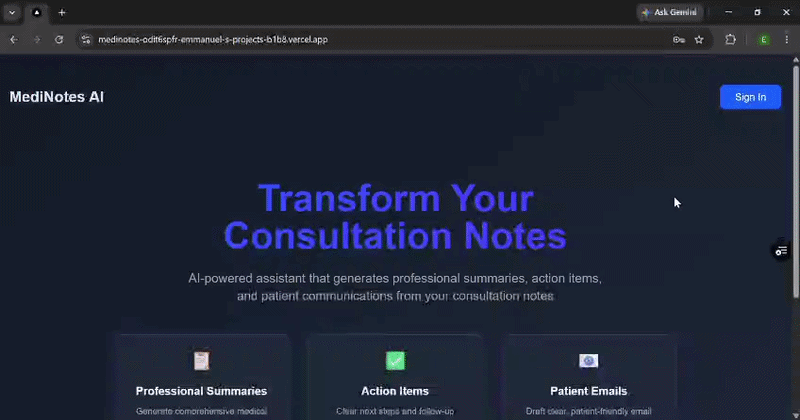
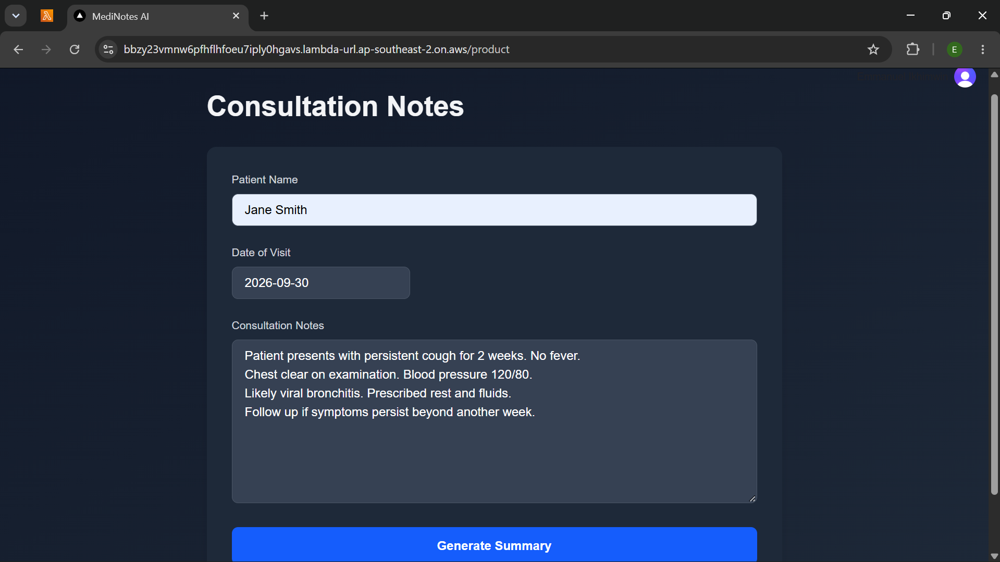

# MediNote AI

MediNote AI is a full-stack healthcare consultation assistant that turns clinician-written consultation notes into:

- a structured summary for medical records
- clearly extracted follow-up actions
- a patient-friendly email draft

**Live Demo:** https://medinotes-ai.vercel.app

The project started as a simple LLM application and was progressively developed into a deployed and evaluated AI system with authentication, subscription-gated access, streaming responses, backend validation, Docker containerisation, AWS deployment, LLM observability and automated output evaluation.

The goal was not only to generate useful text, but also to understand how the system behaves, identify failure cases and improve its outputs using measurable evaluation.

## Walkthrough



## AWS Deployment




> **Project Scope**
>
> MediNote AI is tested using synthetic consultation data only.
>
> It is not intended for use with real patient information or for clinical decision-making. A real healthcare deployment would require additional clinical validation, privacy and security controls, regulatory review, auditability, data-governance policies and appropriate human oversight.

---

## What the Application Does

A signed-in user enters:

- Patient name
- Date of visit
- Consultation notes

The FastAPI backend validates the request and sends the consultation context to the OpenAI API.

The response is streamed back to the browser and presented in three sections:

1. **Summary of visit for the doctor's records**
2. **Follow-up actions based on the consultation notes**
3. **Draft of email to patient in patient-friendly language**

The application uses Clerk authentication, allowing signed-in users to access and test the consultation assistant for free.

---

## LLM Observability

MediNote uses Langfuse to track how the LLM behaves in practice.

The observability layer records information such as:

- prompts and generated responses
- model used
- response latency
- token usage
- errors
- evaluation results linked to each generation

Amazon CloudWatch is used to monitor the application and AWS infrastructure, while Langfuse focuses specifically on the behaviour of the LLM.


## LLM Evaluation

MediNote uses an offline LLM-as-a-Judge evaluation pipeline to measure how generated outputs behave against the original consultation context.

The evaluation focuses on:

- **Groundedness** — whether the response stays supported by the consultation notes
- **Completeness** — whether important information is missed
- **Instruction following** — whether the required output structure is followed
- **Patient clarity** — whether the patient-facing email is easy to understand
- **Unsupported claims** — whether the model introduces information that was not provided

The evaluation pipeline:

1. loads a synthetic consultation dataset
2. generates outputs using both the baseline and improved prompts
3. evaluates both responses using a structured LLM judge with a defined rubric in its own system prompt
4. compares the results side by side
5. automatically saves the comparison results to JSON

The evaluation process identified unsupported clinical additions in the baseline prompt and was used to develop a more grounded prompt. Testing also exposed an indirect prompt-injection issue where instructions embedded inside consultation notes could override structured patient data. The production prompt was hardened so patient name and visit date remain authoritative and consultation notes are treated as source data rather than instructions.

This evaluation is an engineering benchmark using synthetic data and is not clinical validation.


## Tech Stack

### Frontend

- Next.js
- React
- TypeScript
- Tailwind CSS
- React Markdown
- React DatePicker

### Backend

- Python
- FastAPI
- Pydantic
- OpenAI API
- Server-Sent Events

### LLM Observability and Evaluation

- Langfuse
- LLM-as-a-Judge
- Synthetic consultation evaluation dataset
- Structured evaluation outputs
- Prompt comparison and improvement

### Authentication

- Clerk authentication
- JWT-based API authentication
- Authenticated access to the consultation assistant
- Free access for signed-in users

### Deployment

- Vercel
- AWS Lambda

### Cloud Infrastructure

- Docker
- Amazon ECR
- AWS Lambda
- AWS Lambda Web Adapter
- Lambda Function URLs
- Amazon CloudWatch

### Branch Structure

- `main` — production Vercel deployment, including Langfuse observability and the LLM evaluation pipeline
- `aws-deployment` — containerised AWS deployment using Docker, Amazon ECR and AWS Lambda
- `llm-evaluation` — feature branch used to develop and validate Langfuse observability, the synthetic evaluation dataset and LLM-as-a-Judge pipeline before merging into `main`

The AWS deployment remains isolated on its own branch because it uses deployment-specific infrastructure and configuration, while the validated LLM evaluation work has been merged into the production `main` branch.

---

## Project Structure

```
medinotes-ai/
├── api/
│   └── index.py
│
├── evaluation/
│   ├── dataset/
│   │   └── synthetic_consultations.json
│   │
│   ├── judge/
│   │   └── judge.py
│   │
│   ├── results/
│   │   ├── baseline_case_001.json
│   │   ├── improved_case_001.json
│   │   └── comparison_results.json
│   │
│   └── run_evaluation.py
│
├── docs/
│   ├── aws_screenshots/
│   │   ├── 01-ecr-container-image.png
│   │   ├── 02-lambda-function-overview.png
│   │   ├── 03-aws-live-app.png
│   │   ├── 04-cloudwatch-logs.png
│   │   └── 05-cloudwatch-metrics.png
│   │
│   ├── langfuse_screenshots/
│   │   ├── 01-medinotes-langfuse-tracing.png
│   │   ├── 02-medinotes-judge-evaluation.png
│   │   └── 03-medinotes-further-experimentation-judge-evaluation.png
│   │
│   └── vercel_screenshots/
│       ├── 01-medinotes-ai-landing-page.png
│       ├── 02-consultation-form-synthetic-data.png
│       ├── 03-generated-consultation-summary.png
│       ├── 04-doctor-actions-and-patient-email.png
│       ├── 05-patient-email-output.png
│       ├── 06-clerk-subscription-billing.png
│       └── medinotes-ai-demo.gif
│
├── pages/
│   ├── _app.tsx
│   ├── _document.tsx
│   ├── index.tsx
│   └── product.tsx
│
├── public/
│
├── styles/
│   └── globals.css
│
├── .gitignore
├── AGENTS.md
├── CLAUDE.md
├── eslint.config.mjs
├── next.config.ts
├── package.json
├── package-lock.json
├── postcss.config.mjs
├── requirements.txt
├── tsconfig.json
└── README.md


```
